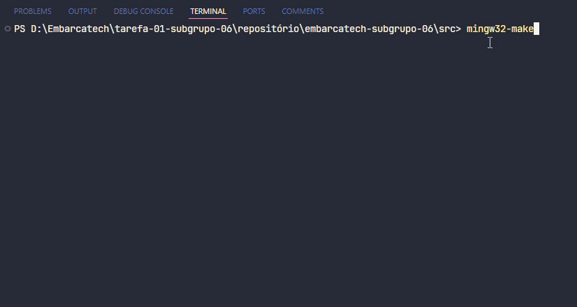

<div align="center">
    
</div>

<br>

# Programa Conversor de Unidades

Este programa é um **Conversor de Unidades** desenvolvido em **C** como parte de uma atividade do projeto **Embarcatech**. O objetivo é realizar conversões entre diferentes sistemas de medida, abrangendo as seguintes funcionalidades:

1. **Unidades de Comprimento**  
   - Metro (m), Centímetro (cm), Milímetro (mm)
2. **Unidades de Massa**  
   - Quilograma (kg), Grama (g), Tonelada (t)
3. **Unidades de Volume**  
   - Litro (L), Mililitro (mL), Metros cúbicos (m³)
4. **Unidades de Temperatura**  
   - Celsius (°C), Fahrenheit (°F), Kelvin (K)
5. **Unidades de Velocidade**  
   - Quilômetros por hora (km/h), Metros por segundo (m/s), Milhas por hora (mph)
6. **Unidades de Potência**  
   - Watts (W), Quilowatts (kW), Cavalos-vapor (cv ou hp)
7. **Unidades de Área**  
   - Metro quadrado (m²), Centímetro quadrado (cm²)
8. **Unidades de Tempo**  
   - Segundos (s), Minutos (min), Horas (h)
9. **Unidades de Armazenamento de Dados**  
   - Bits, Bytes (B), Kilobytes (KB), Megabytes (MB), Gigabytes (GB), Terabytes (TB)

<br>

## Pré-requisitos

- **Sistema Operacional:** O programa pode ser executado em sistemas Windows, macOS ou Linux.  
- **Compilador C:** É necessário um compilador compatível com a linguagem C, como:
  - GCC (GNU Compiler Collection)
  - Clang  
  - Outro compatível com ANSI C.
- **Ferramenta de Compilação:** Certifique-se de que o **mingw32-make** esteja devidamente configurado para compilar o projeto corretamente.

<br>

## Como Compilar

1. Certifique-se de que o GCC ou outro compilador esteja instalado no sistema.  
2. Faça o download ou clone este repositório.
    ```bash
    git clone git@github.com:ferreiiratech/embarcatech-subgrupo-06.git
    ```

3. Navegue até o diretório do projeto no terminal.  
4. Compile o programa com o comando:  
   ```bash
   mingw32-make 
   ```
   ou 
    ```bash
    make
    ```

5. Execute o programa com o comando:
   ```bash
   ./main
   ```
<br>

## Como usar  

1. Após compilar o programa, execute-o.  
2. O programa exibirá um menu com as seguintes opções de conversão:  
    - **1. Conversão de Volume**  
    - **2. Conversão de Comprimento**  
    - **3. Conversão de Massa**  
    - **4. Conversão de Armazenamento de Dados**  
    - **5. Conversão de Velocidade**  
    - **6. Conversão de Potência**  
    - **7. Conversão de Área**
    - **8. Conversão de Tempo**
    - **9. Conversão de Temperatura**
    - **10. Sair** 
3. Digite o número correspondente à conversão desejada.  
4. O programa solicitará a entrada de um valor ou subopção, dependendo do tipo de conversão selecionado.  
5. Insira o valor a ser convertido.  
6. O resultado da conversão será exibido na tela.  
7. Caso deseje realizar outra conversão, o menu reaparecerá. Digite outra opção ou selecione "7" para encerrar o programa.  
8. Se uma opção inválida for digitada, o programa exibirá uma mensagem de erro e solicitará uma nova entrada.  

<br>

## Exemplo de Uso



## Estrutura de Pastas
A estrutura de pastas foi organizada para facilitar a manutenção e o entendimento do projeto. A seguir, está a disposição dos arquivos e diretórios:

```bash
/src
  |-- area_conversion.c
  |-- main.c
  |-- main.h
  |-- Makefile
  |-- mass_conversion.c
  |-- potencia_conversion.c
  |-- shared.c
  |-- shared.h
  |-- size_conversion.c
  |-- speed_conversion.c
  |-- storage_conversion.c
  |-- temperature_conversion.c
  |-- time_conversion.c
  |-- volume_conversion.c
.gitignore
README.md
```

<br>

## Colaboradores
<table>
  <tr>
    <td align="center">
      <a href="https://github.com/ferreiiratech">
        <br>
        <sub>
          <b>Leonardo Ferreira</b>
        </sub>
      </a>
    </td>
    <td align="center">
      <a href="https://github.com/yasmincsme">
        <br>
        <sub>
          <b>Yasmin Cordeiro</b>
        </sub>
      </a>
    </td>
    <td align="center">
      <a href="https://github.com/thalissoncastrog">
        <br>
        <sub>
          <b>Thalisson Castro</b>
        </sub>
      </a>
    </td>
    <td align="center">
      <a href="https://github.com/ArthurSaldanha01">
        <br>
        <sub>
          <b>Arthur Saldanha</b>
        </sub>
      </a>
    </td>
        <td align="center">
      <a href="https://github.com/ateniltonjr">
        <br>
        <sub>
          <b>Atenilton Santos</b>
        </sub>
      </a>
    </td>
    </td>
        <td align="center">
      <a href="https://github.com/bigodinhojf">
        <br>
        <sub>
          <b>João Felipe</b>
        </sub>
      </a>
    </td>
  </tr>
  <tr>
    </td>
        <td align="center">
      <a href="https://github.com/SamuelLopesH">
        <br>
        <sub>
          <b>Samuel Lopes</b>
        </sub>
      </a>
    </td>
    </td>
        <td align="center">
      <a href="https://github.com/nrocha46">
        <br>
        <sub>
          <b>Nicole Rocha</b>
        </sub>
      </a>
    </td>
  </tr>
</table>
